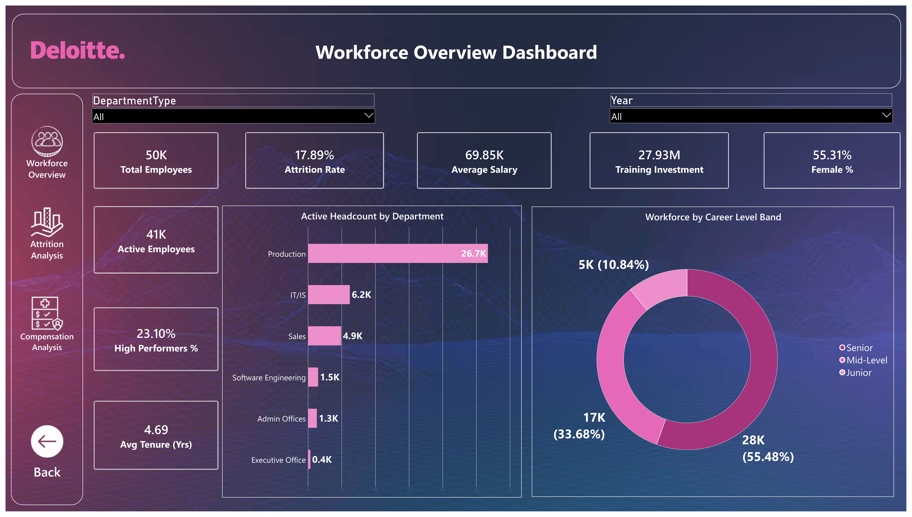
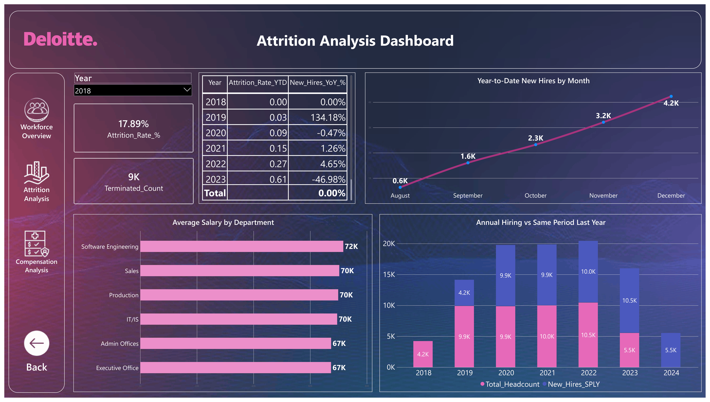
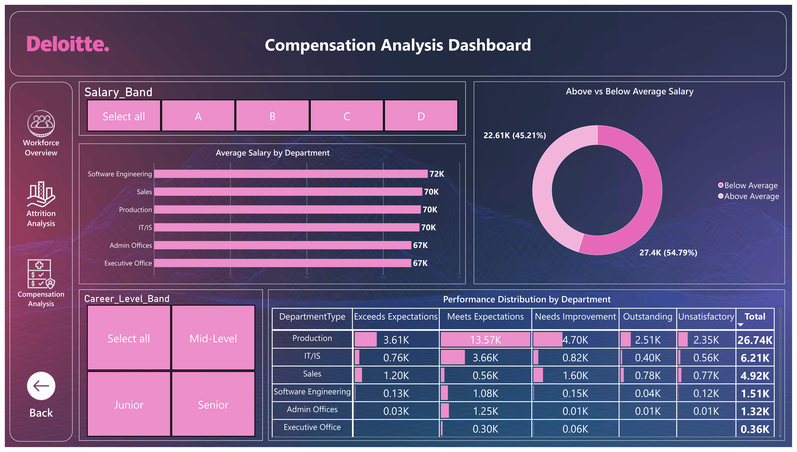

# 📊 Workforce Analytics Dashboard

> **Interactive Power BI dashboard for workforce, attrition, and compensation analytics.**

[](https://powerbi.microsoft.com/)
[]()
[]()

---

## 🖥️ Dashboard Preview

### Workforce Overview


### Attrition Analysis


### Compensation Analysis


---

## 📌 Project Overview

The **Workforce Analytics Dashboard** is an interactive Power BI solution designed to transform employee data into actionable workforce insights.

The report provides a consolidated view of:

- Workforce size and composition
- Employee attrition and termination trends
- Hiring performance and growth
- Employee tenure
- Salary and compensation distribution
- Department-level salary analysis
- Career-level and salary-band insights
- Gender diversity indicators
- High-performer and workforce metrics

The dashboard is designed with interactive navigation, slicers, KPI cards, charts, and detailed tables to make HR analytics easier to explore and interpret.

---

## 📑 Dashboard Pages

| Page | Purpose |
|---|---|
| **Workforce Overview** | High-level view of headcount, workforce composition, hiring, tenure, and employee demographics |
| **Attrition Analysis** | Identifies attrition patterns, termination trends, and workforce retention insights |
| **Compensation Analysis** | Analyzes salary distribution, compensation by department/career level, and salary bands |
| **Navigation & Title** | Provides report navigation and dashboard entry experience |

---

## 🎯 Key KPIs

The report includes measures such as:

- **Total Headcount**
- **Active Headcount**
- **Attrition Rate**
- **YTD Attrition Rate**
- **Average Salary**
- **Average Tenure**
- **Terminated Employees**
- **YTD New Hires**
- **New Hires YoY %**
- **New Hires SPLY**
- **Total Training Cost**
- **Gender Diversity Ratio**
- **High Performer %**
- **Salary Rank by Department**

---

## 📊 Visual Analytics

### Workforce Overview
The overview page combines KPI cards with demographic and workforce visuals to provide a quick snapshot of the organization.

**Included analysis:**
- Headcount KPIs
- Active workforce
- Average tenure
- New-hire metrics
- Gender/workforce composition
- Department-level workforce analysis
- Interactive slicers

### Attrition Analysis
The attrition page focuses on understanding employee turnover and identifying patterns that may require management attention.

**Included analysis:**
- Attrition KPIs
- Attrition by department/category
- Monthly attrition trends
- Termination analysis
- Employee-level detail table
- Interactive filtering

### Compensation Analysis
The compensation page provides a structured view of employee salary and compensation patterns.

**Included analysis:**
- Average salary
- Salary distribution
- Salary bands
- Department-level salary comparison
- Career-level compensation
- Salary ranking
- Detailed compensation table

---

## 🧠 DAX & Data Modeling

The dashboard uses a Power BI semantic model with calculated measures for workforce and HR analytics.

Example analytical measures represented in the report include:

```DAX
Total Headcount
Active Headcount
Attrition Rate %
Attrition Rate YTD
Avg Salary
Avg Tenure
Terminated Count
YTD New Hires
New Hires YoY %
New Hires SPLY
Total Training Cost
Gender Diversity Ratio
High Performer %
Salary Rank Dept
```

The calculations are designed to respond dynamically to report filters and slicers.

---

## 🎛️ Interactivity

The report includes:

- Department filters
- Year / time filters
- Salary-related filters
- Interactive cross-filtering
- Drill-style analysis
- Navigation buttons
- KPI cards
- Dynamic charts
- Detailed tables

This allows users to move from an organization-level overview to more focused workforce and compensation analysis.

---

## 🛠️ Tools & Technologies

| Technology | Usage |
|---|---|
| **Microsoft Power BI** | Dashboard development & visualization |
| **DAX** | Measures and analytical calculations |
| **Power Query** | Data transformation and preparation |
| **Data Modeling** | Relationships and semantic model design |
| **Interactive UX** | Slicers, navigation, filters and drill interactions |

---

## 📂 Repository Structure

```text
Workforce-Analytics/
│
├── 📊 PR_4.pbix
├── 📄 README.md
└── Images/
    ├── Workforce-Overview.png
    ├── Attrition-Analysis.png
    └── Compensation-Analysis.png
```

---

## 🚀 How to Use

1. Download or clone this repository.
2. Open `PR_4.pbix` using **Microsoft Power BI Desktop**.
3. Refresh the data if the underlying source is available.
4. Use the navigation controls to move between dashboard pages.
5. Interact with slicers and visuals to explore the workforce data.

---

## 💡 Business Questions Answered

This dashboard can help answer questions such as:

- How large is the active workforce?
- What is the current attrition rate?
- How is attrition changing over time?
- Which departments experience higher employee turnover?
- How many new employees were hired during the year?
- What is the average employee salary?
- Which departments have higher or lower compensation?
- How is compensation distributed across salary bands?
- What is the average employee tenure?
- What proportion of the workforce represents high performers?
- How does gender diversity vary across the organization?

---

## 📈 Project Highlights

- ✅ Portfolio-ready HR analytics dashboard
- ✅ Multi-page Power BI report
- ✅ KPI-driven executive overview
- ✅ Interactive filtering and navigation
- ✅ Attrition and retention analysis
- ✅ Compensation intelligence
- ✅ Department-level comparisons
- ✅ Time-based workforce analysis
- ✅ DAX-based analytical measures
- ✅ Professional dashboard-focused UI

---

## 👤 Author

**Darshan Patil**

Power BI • Data Analytics • Business Intelligence

---

## ⭐ If You Find This Project Useful

If you like this dashboard or find it useful for learning Power BI and data analytics, consider giving the repository a ⭐.

---
